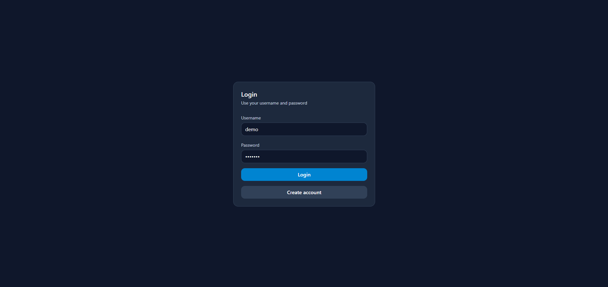
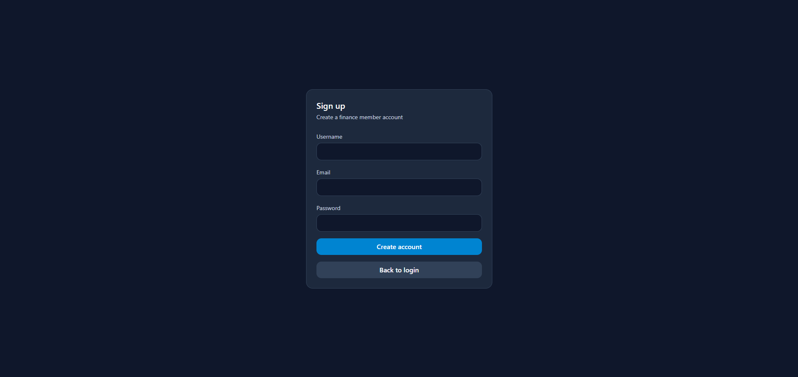
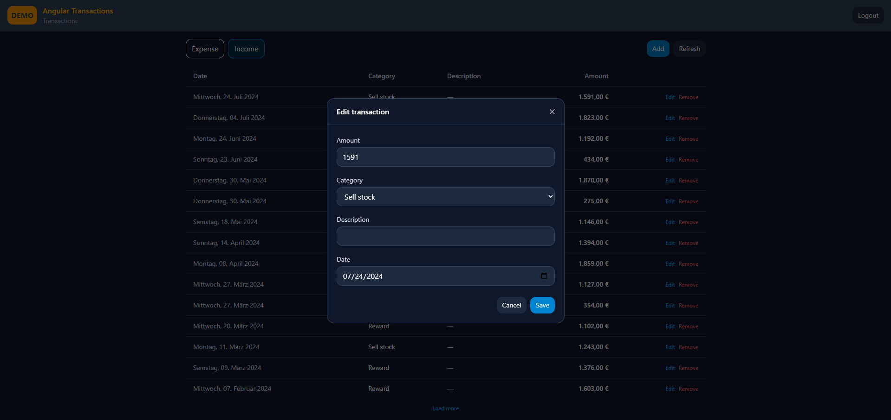
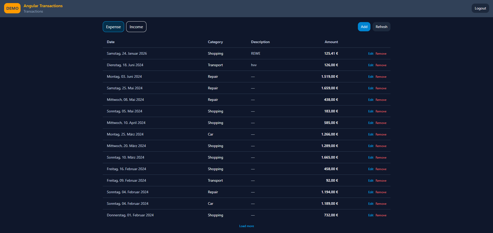

# Angular Transactions

A focused Angular repository showcasing a standalone **Transactions** feature (CRUD + pagination) with a minimal **Auth (Login/Signup)** flow.  
Built to demonstrate clean architecture, RxJS-first async handling, testing, and production-ready project hygiene.

---

## Demo

- Live demo: **TBD**
- Test user: **demo / demo123** (example)

---

## Features

- **Auth**
  - Signup (email + username + password)
  - Login (username + password)
  - Session stored locally
  - Backendless table: `financeMembers`

- **Transactions**
  - List transactions with **Load more** pagination
  - **Add / Edit / Remove**
  - Category mapping (ID → name)
  - Date formatting (German locale)
  - Amount formatting with `€`

- **UI**
  - Header (no sidebar)
  - Toast notifications (success/error/info)
  - TailwindCSS styling

- **Quality**
  - Observable-first (RxJS end-to-end; no async/await in core flows)
  - Unit tests + component tests (Vitest)
  - Lightweight E2E tests (Playwright) with API mocking
  - PWA-ready setup

---

## Tech Stack

- **Angular** 19 (standalone components, signals)
- **TypeScript**, **RxJS**
- **TailwindCSS**
- **Backendless REST API**
- **Testing**
  - Vitest (unit + component)
  - Playwright (E2E)

---

## Project Structure

```
src/app
  core/
    api/                 # ApiService
    auth/                # AuthService, guards, storage
  features/
    auth/                # login/signup pages + data-access repository
    transactions/        # page + store + repositories + UI components
  shared/
    models/              # IBase + domain models
    toast/               # ToastService + host component
docs/
  architecture.md
  decisions.md
  testing.md
  release-checklist.md
```

---

## Install

```bash
npm install
npm start

```

## Testing

### Unit + Component (Vitest)
```bash
npm test
```

Covered:
- repositories (API calls)
- store (pagination + CRUD + error paths)
- key components (TxTable, TxFormModal, Login, Signup)

### E2E (Playwright)
```bash
npm run e2e
```

E2E tests mock all network requests to avoid external dependencies.

---

## Scripts

Common scripts:

```bash
npm start
npm test
npm run e2e
npm run build
```

---

## Screenshots / GIFs

### Login



### Modal


### Transactions


---

## Roadmap

- [ ] Netlify deployment + env vars
- [ ] GitHub Actions CI (unit + e2e)
- [ ] Minor accessibility pass
- [ ] search/filter in transactions list